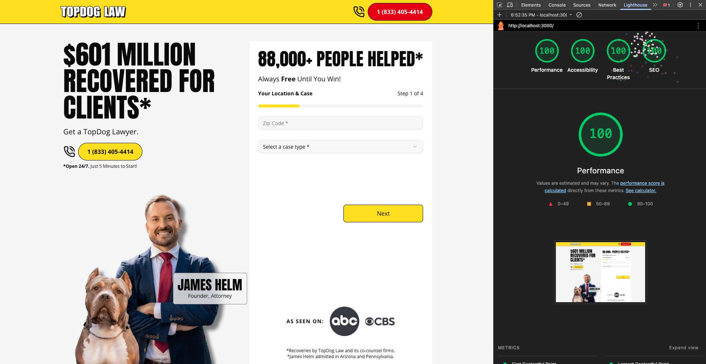
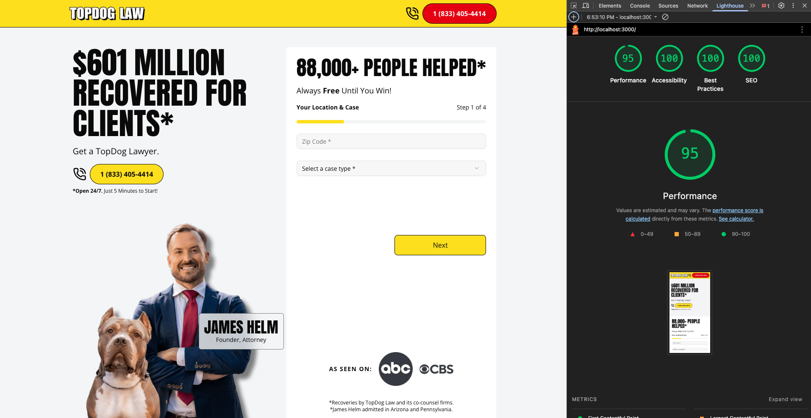

# Landing Page Recreation

A recreation of the landing page built with Next.js App Router and Tailwind CSS.

## Local Development

### Requirements

- **Node.js**: v24.11.1 (or compatible LTS version)

### Install Dependencies

```bash
pnpm install
```

### Run Development Server

```bash
pnpm dev
```

Open [http://localhost:3000](http://localhost:3000) in your browser.

### Build Production Version

```bash
pnpm build
pnpm start
```

## Lighthouse Results

### Settings Used

- **Mode**: Navigation (default)
- **Device**: Mobile and Desktop (run separately)
- **Categories**: Performance, Accessibility, Best Practices, SEO
- **Throttling**: Simulated throttling (default)

### Desktop



| Metric         | Score |
| -------------- | ----- |
| Performance    | 100   |
| Accessibility  | 100   |
| Best Practices | 100   |
| SEO            | 100   |

### Mobile



| Metric         | Score |
| -------------- | ----- |
| Performance    | 95    |
| Accessibility  | 100   |
| Best Practices | 100   |
| SEO            | 100   |

## Approach & Tradeoffs

- Next.js Image component with automatic optimization
- Font optimization via `next/font`
- Use server components wherever possible to reduce client bundle size
- **Form Submission**: The lead form wizard collects data but submits to a local stub (console log) rather than a real endpoint.

### Component Architecture

```
components/
├── home-page/           # Page-specific sections
│   ├── hero.tsx
│   ├── features.tsx
│   ├── case-types.tsx
│   ├── call-to-action.tsx
│   ├── testimonials.tsx
│   └── case-wizard/     # Multi-step form wizard
├── shell/               # Layout components
│   ├── header.tsx
│   └── footer.tsx
└── ui/                  # Reusable UI primitives
```

## Metadata Strategy

### Next.js Metadata API

Metadata is configured using Next.js's static metadata export in `app/layout.tsx` and `app/page.tsx`. Failing to export metadata in a given route will default to the parent layout's metadata.

### For Templated City/Case Type Pages

For a multi-location or multi-case-type site, I would use `generateMetadata`:

```typescript
// app/[city]/[caseType]/page.tsx
export async function generateMetadata({ params }): Promise<Metadata> {
  const { city, caseType } = params

  return {
    title: `${caseType} Lawyer in ${city}`,
    description: `TopDog Law provides ${caseType} legal services in ${city}. Free consultation available 24/7.`,
    openGraph: {
      title: `${caseType} Lawyer in ${city} | TopDog Law`,
      description: `Get expert ${caseType} representation in ${city}.`,
      url: `https://topdoglaw.com/${city}/${caseType}`,
    },
  }
}
```

Since we have unique locations and case types in this scenario, [Satori](https://github.com/vercel/satori) is a great tool to bring in for automating the generation of personalized Open Graph images.

## Schema / JSON-LD Implementation

```typescript
// app/page.tsx
const jsonLd = {
  "@context": "https://schema.org",
  "@graph": [
    {
      "@type": "LegalService",
      "@id": "https://topdoglaw.com/#legalservice",
      name: "TopDog Law",
      description:
        "TopDog Law is a personal injury law firm dedicated to fighting for maximum compensation for accident victims.",
      url: "https://topdoglaw.com",
      telephone: "+1-833-TOP-DOG1",
      priceRange: "Free Consultation",
      image: "https://topdoglaw.com/logo.png",
      address: {
        "@type": "PostalAddress",
        streetAddress: "1500 John F Kennedy Blvd",
        addressLocality: "Philadelphia",
        addressRegion: "PA",
        postalCode: "19102",
        addressCountry: "US",
      },
      geo: {
        "@type": "GeoCoordinates",
        latitude: 39.9526,
        longitude: -75.1652,
      },
      openingHoursSpecification: {
        "@type": "OpeningHoursSpecification",
        dayOfWeek: [
          "Monday",
          "Tuesday",
          "Wednesday",
          "Thursday",
          "Friday",
          "Saturday",
          "Sunday",
        ],
        opens: "00:00",
        closes: "23:59",
      },
      areaServed: {
        "@type": "State",
        name: "Pennsylvania",
      },
      serviceType: [
        "Personal Injury Law",
        "Car Accident Claims",
        "Truck Accident Claims",
        "Motorcycle Accident Claims",
        "Slip and Fall Claims",
        "Medical Malpractice",
        "Wrongful Death Claims",
      ],
      hasOfferCatalog: {
        "@type": "OfferCatalog",
        name: "Legal Services",
        itemListElement: [
          {
            "@type": "Offer",
            itemOffered: {
              "@type": "Service",
              name: "Free Case Evaluation",
              description: "No-obligation consultation to review your case",
            },
          },
          {
            "@type": "Offer",
            itemOffered: {
              "@type": "Service",
              name: "Personal Injury Representation",
              description:
                "Legal representation for accident victims on a contingency fee basis",
            },
          },
        ],
      },
      sameAs: [
        "https://www.facebook.com/topdoglaw",
        "https://www.instagram.com/topdoglaw",
        "https://www.youtube.com/@topdoglaw",
        "https://www.tiktok.com/@topdoglaw",
      ],
    },
    {
      "@type": "Organization",
      "@id": "https://topdoglaw.com/#organization",
      name: "TopDog Law",
      url: "https://topdoglaw.com",
      logo: {
        "@type": "ImageObject",
        url: "https://topdoglaw.com/logo.png",
        width: 300,
        height: 60,
      },
      contactPoint: {
        "@type": "ContactPoint",
        telephone: "+1-833-TOP-DOG1",
        contactType: "customer service",
        availableLanguage: ["English", "Spanish"],
        areaServed: "US",
      },
      sameAs: [
        "https://www.facebook.com/topdoglaw",
        "https://www.instagram.com/topdoglaw",
        "https://www.youtube.com/@topdoglaw",
        "https://www.tiktok.com/@topdoglaw",
      ],
    },
    {
      "@type": "WebPage",
      "@id": "https://topdoglaw.com/#webpage",
      url: "https://topdoglaw.com",
      name: "TopDog Law | Personal Injury Attorneys",
      description:
        "TopDog Law is a personal injury law firm fighting for maximum compensation. Free consultations available 24/7.",
      isPartOf: {
        "@id": "https://topdoglaw.com/#website",
      },
      about: {
        "@id": "https://topdoglaw.com/#legalservice",
      },
      primaryImageOfPage: {
        "@type": "ImageObject",
        url: "https://topdoglaw.com/og-image.png",
      },
    },
    {
      "@type": "WebSite",
      "@id": "https://topdoglaw.com/#website",
      url: "https://topdoglaw.com",
      name: "TopDog Law",
      publisher: {
        "@id": "https://topdoglaw.com/#organization",
      },
    },
  ],
}
```

The implementation includes four interconnected schema types:

1. **LegalService**: Primary schema for law firm discovery, includes service types, contact info, and business hours.

2. **Organization**: Establishes brand identity with logo, contact points, and social profiles.

3. **WebPage**: Describes the specific page content and its relationship to the site.

4. **WebSite**: Top-level site information with publisher relationship.
